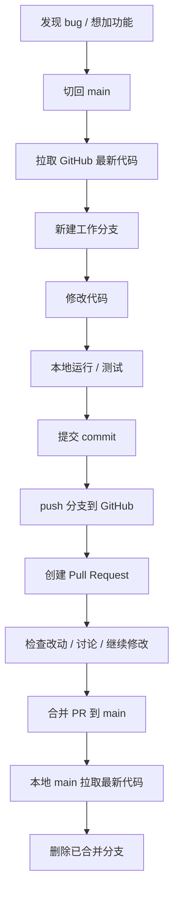

# GitHub 维护操作手册

这份手册适合第一次用 GitHub 维护项目时照着做。你可以把 GitHub 理解成“云端代码仓库”，本地电脑是“工作台”，每次改 bug 或加功能，都先在本地开一个分支，改完推到 GitHub，再用 PR 合并回主线。

## 核心概念

- `main`：主分支，放稳定代码。
- 分支：一次 bug 修复或功能开发的临时工作区。
- commit：一次保存记录，类似“游戏存档”。
- push：把本地提交上传到 GitHub。
- Pull Request，简称 PR：请求把某个分支的改动合并进 `main`。
- merge：合并 PR，把改动正式放进主分支。

## 整体流程图



## 每次开始改代码前

先回到主分支，并确保本地是最新的：

```bash
cd /Users/theo/Downloads/2FA/TwoFA-Harmony
git switch main
git pull --ff-only origin main
```

## 修 bug 的标准流程

假设要修“倒计时动画卡顿”：

```bash
git switch -c fix/countdown-animation
```

改代码后，先看改了哪些文件：

```bash
git status
```

测试或同步项目：

```bash
DEVECO_SDK_HOME=/Applications/DevEco-Studio.app/Contents/sdk \
"/Applications/DevEco-Studio.app/Contents/tools/hvigor/bin/hvigorw" --sync --no-daemon
```

把改动保存成 commit：

```bash
git add .
git commit -m "Fix countdown animation"
```

上传分支到 GitHub：

```bash
git push -u origin fix/countdown-animation
```

## 加功能的标准流程

假设要加“编辑账号详情”：

```bash
git switch main
git pull --ff-only origin main
git switch -c feat/edit-account
```

改完后：

```bash
git status
git add .
git commit -m "Add account editing"
git push -u origin feat/edit-account
```

## 在 GitHub 创建 PR

打开仓库页面：

```text
https://github.com/qiuhb2014/kanmen-de-lailai
```

然后：

1. 点击 `Pull requests`
2. 点击 `New pull request`
3. `base` 选择 `main`
4. `compare` 选择你的分支，比如 `fix/countdown-animation`
5. 写标题和说明
6. 点击 `Create pull request`

PR 标题示例：

```text
Fix countdown animation
```

PR 说明示例：

```text
## 改动内容

- 优化首页倒计时圆环刷新
- 保持验证码按 TOTP 周期刷新

## 验证方式

- DevEco 同步通过
- 手动添加测试账号验证倒计时和复制
```

## 合并 PR 后，本地怎么同步

在 GitHub 点 `Merge pull request` 后，本地执行：

```bash
git switch main
git pull --ff-only origin main
```

删除本地旧分支：

```bash
git branch -d fix/countdown-animation
```

删除 GitHub 上的旧分支：

```bash
git push origin --delete fix/countdown-animation
```

## 分支命名建议

```text
fix/保存失败
fix/countdown-animation
fix/totp-code-refresh
feat/account-detail
feat/edit-account
feat/import-export
docs/github-workflow
chore/project-config
```

推荐用英文短句，GitHub 显示更清楚。如果你自己看中文更舒服，也可以用中文。

## commit 信息怎么写

commit 信息用一句话说明“做了什么”：

```text
Fix account saving crash
Add account detail page
Update GitHub workflow docs
Refine home token card layout
```

常用开头：

- `Fix ...`：修 bug
- `Add ...`：加功能
- `Update ...`：更新已有内容
- `Remove ...`：删除内容
- `Refine ...`：优化体验或样式

## 日常只需要记住这 8 条

```bash
git switch main
git pull --ff-only origin main
git switch -c fix/your-branch-name
git status
git add .
git commit -m "Your commit message"
git push -u origin fix/your-branch-name
git switch main
```

## 遇到问题时先看这几个命令

看当前在哪个分支、有没有没提交的文件：

```bash
git status --short --branch
```

看最近提交：

```bash
git log --oneline --decorate --max-count=5
```

看远端仓库地址：

```bash
git remote -v
```

## 最安全的协作原则

- 不直接在 `main` 上改大功能。
- 一个分支只做一件事。
- 每次开始前先 `git pull --ff-only origin main`。
- 提交前先 `git status` 看一眼。
- 合并前在 PR 里写清楚改了什么、怎么验证。

